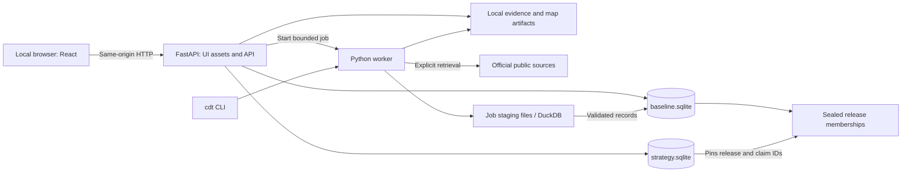

# Technical architecture: local Mac application

Status: Target design, aligned September 29, 2026 to personal research and agent-assisted exploration. See [current execution state](execution/state.md) for verified behavior; planned access, collection and backup workflows below are not implemented capabilities.
Date: September 26, 2026.  
Scope: [MVP plan](mvp-plan.md), with the [UI concepts](ui-concepts/README.md) as visual direction.  
Deployment target: One user, one MacBook, local browser, native processes.

## 1. Architecture decision

Build a **Python modular monolith with a React frontend, SQLite persistence, and local evidence files**. Serve the compiled frontend and API from one process on `127.0.0.1`. Start a separate Python worker only for ingestion, document processing, and release builds. Use DuckDB inside that worker for large tabular transformations when needed; SQLite remains the application's authoritative database.

This supersedes the MVP plan's provisional PostgreSQL/PostGIS recommendation. County/tract filtering, linked profiles, evidence search, and curated relationships do not initially require a database server. Perform geographic validation and preprocessing in Python and serve prepared GeoJSON. Reconsider PostGIS if interactive spatial analysis or parcel-scale workloads become necessary.

Daily operation should be: start the app, open the browser, inspect saved evidence, and stop the app. Browsing and editing private research work offline after installation and initial ingestion. External source retrieval and opening original source links require network access. No Docker daemon, cloud service, local language model, or always-running scheduler is required.

### Local environment observed

Read-only checks during design found Apple Silicon (`arm64`), macOS 15.4.1, Python 3.12.1, uv 0.11.14, and Node 25.2.1. The inspected Python links SQLite 3.43.1 with FTS5 available. Installed memory was not accessible through the execution sandbox and is unknown. These observations establish feasibility, not a supported dependency matrix; use a project-managed runtime rather than relying on whatever global binaries happen to be installed.

## 2. Goals and operating constraints

| Requirement | Design response |
| --- | --- |
| Minimal local administration | One command to start; embedded databases; ordinary local files; no containers |
| Evidence is auditable | Immutable claim versions, exact evidence references, derivation lineage, and sealed releases |
| Laptop can sleep or disconnect | Checkpointed jobs; explicit retry; previous release stays available |
| Work without internet | Local UI assets, geographic layers, search index, and permitted source snapshots |
| Family strategy stays separate | Separate private database, artifact directory, services, search, and export path |
| Source data can exceed RAM | Streaming downloads, bounded worker, chunked reads, optional DuckDB spill |
| Ordinary research remains responsive | Published baseline reads are independent of unpublished candidate data; heavy work runs outside HTTP requests |
| Future portability | Explicit schema, versioned JSON/CSV/Markdown exports, source adapters, and application service boundaries |

The MVP is not a multiuser service. It does not need distributed transactions, Kubernetes, Redis, a message broker, a graph database, a vector database, server-side rendering, or a native desktop wrapper. These omissions are deliberate scope decisions, not extension points to implement now.

Optimize for Jordan's local business discovery, informed contributions and sustainable personal upkeep. Infrastructure work must name the research capability enabled or concrete failure prevented. Reuse accepted evidence/privacy/release safeguards; do not generalize for hypothetical customers, distribution or source families. A useful new dataset or retained document can justify work before UI polish. Existing agents can assist through the bounded research-access contract below without an embedded assistant platform.

## 3. Components and process boundaries



**Web process:** One Uvicorn worker hosts FastAPI, static frontend assets, query endpoints, private brief editing, and job status. Read bounded result sets and close database transactions before returning responses. Dispatch expensive work to a subprocess; do not use an in-process request background task as a durable job runner. FastAPI's server model supports this single-process arrangement ([documentation](https://fastapi.tiangolo.com/deployment/manually/)).

**Job worker:** One active heavy job per data directory. It imports the same Python application services as the CLI, owns its staging directory, and commits short validated batches. It never modifies private strategy records. A process-held filesystem lock prevents a second CLI or web-launched worker from starting competing work. SQLite coordinates short database writes from API and worker; the worker lock is not a substitute for database transactions.

**Frontend:** React and TypeScript built with Vite. Python serves the resulting static assets during ordinary use, so Node is only needed to build or develop the frontend. Development uses a loopback-only Vite server with an API proxy; normal operation uses a single origin. Vite provides the static build output ([documentation](https://vite.dev/guide/build)).

**No network activity on page load:** Map layers, fonts, icons, scripts, and styles ship locally. A basic county/tract map requires no commercial map SDK or tile service. An external basemap may be added later as an explicit optional feature.

## 4. Technology choices

| Area | Choice | Reason and limit |
| --- | --- | --- |
| Python environment | uv, `pyproject.toml`, `uv.lock`, pinned `.python-version` | Isolated, repeatable native runtime; select a supported Python patch after verifying ARM64 dependencies |
| HTTP/contracts | FastAPI, Pydantic, Uvicorn | Shared request validation and generated OpenAPI; one server process |
| CLI | Python entry point `cdt`, with argparse initially | Setup, import, release, validation, backup, and diagnostics use the same services |
| Application storage | Python `sqlite3`; explicit SQL repositories and ordered SQL migrations | Transactions, constraints, relational evidence; avoid an ORM obscuring release filtering |
| Document search | SQLite FTS5 | Local lexical search with snippets; no embeddings required |
| Bulk transformations | DuckDB in worker, added when CBP/NES/LODES volume warrants it | Read local tabular files, aggregate, spill to job-local disk; not an additional serving database |
| Geography | Shapely; pyproj only when projection is needed; prepared GeoJSON | Geographic validation and offline display; no spatial extension in SQLite initially |
| UI | React, TypeScript, Vite; CSS design tokens; Leaflet for maps | Implements the mockup interactions without a separate frontend runtime |
| Extraction | Standard CSV/JSON readers, HTTP client with bounded streaming, PDF text extraction library selected in first document slice | Exact source locators; scanned-document OCR is deferred unless a required source forces it |
| Verification | pytest, frontend component tests, a small Playwright workflow suite | Verify evidence semantics, release consistency, recovery, and user workflows |

Dependency versions must be resolved and locked at implementation, not guessed here. Runtime diagnostics must check SQLite features, foreign-key enforcement, native package imports, writable storage, available disk, and frontend build compatibility. uv's project and lockfile workflow supplies the Python environment mechanism ([documentation](https://docs.astral.sh/uv/guides/projects/)).

FTS5 provides the embedded text index ([documentation](https://www.sqlite.org/fts5.html)); Shapely handles geometry operations ([manual](https://shapely.readthedocs.io/en/stable/manual.html)); Leaflet can render the prepared GeoJSON ([reference](https://leafletjs.com/reference.html#geojson)). These are technology selections, not evidence that application integration has been tested.

## 5. Storage layout and ownership

Keep code and runtime data separate. Proposed default data root:

```text
~/Library/Application Support/ChesterfieldTwin/
  config.toml                     # Non-secret local configuration
  baseline.sqlite                 # Sources, evidence, versions, releases, jobs
  private/
    strategy.sqlite               # Briefs, personal assumptions, research queue
    artifacts/                    # Private exports and scenario attachments
  objects/sha256/<prefix>/<hash>   # Permitted immutable source/derived artifacts
  releases/<release-id>/
    manifest.json
    checks.json
  staging/<job-id>/                # Partial downloads and transformation output
  cache/                          # Disposable caches only
  logs/                           # Rotating operational logs
  locks/                          # Process and maintenance locks
```

Allow a `CDT_DATA_DIR` override, but require a local filesystem. Do not place active databases in iCloud Drive, Dropbox, or a network share. Use a separate explicit destination for completed backup archives. User-only directory permissions are the default. The data directory is outside Git; `.gitignore` also excludes accidental local databases, credentials, `.venv`, caches, and build output within the repository.

**Two databases, two purposes:** `baseline.sqlite` contains public-source evidence and operational metadata; `strategy.sqlite` contains private judgments. This is a structural boundary, not encryption or protection against another process running as the same macOS user. The baseline repository cannot open the strategy database. Private services can read a pinned baseline release through a read-only repository. Do not use cross-database `ATTACH` queries or transactions.

**Artifact ownership:** Raw objects are addressed by SHA-256 of their bytes. Retrieval events separately record where and when those bytes were obtained. Identical downloads reuse one object but preserve each retrieval event. Derived objects additionally record inputs, transformation version, and parameters. Never replace bytes at an existing content address.

**SQLite operating mode:** Initially use rollback journaling (`journal_mode=DELETE`), `foreign_keys=ON`, `synchronous=FULL`, and a bounded busy timeout on every mutable connection. Short reads and writes suit the expected single-user workload. Keep bulk transformations outside the database and batch inserts. Return a retryable busy error if contention exceeds the timeout. Reconsider WAL only after measuring contention and checking the actual linked SQLite version against current fixes. WAL introduces sidecar-file, checkpoint, and cross-database atomicity considerations ([SQLite documentation](https://www.sqlite.org/wal.html)).

## 6. Data model and invariants

Use stable opaque IDs for domain identity and immutable version IDs for evidence content. Store UTC timestamps separately from source-local dates and reference periods. Geographic IDs remain strings so leading zeroes survive. Store exact money as integer minor units or decimal strings; calculate scenario economics with Python Decimal. Use explicit units and numeric scale for statistical measures.

| Tables / record groups | Essential content |
| --- | --- |
| `source`, `source_version`, `retrieval`, `artifact` | Publisher, source key, terms, scope, selected release, URLs, request metadata with credentials removed, retrieval outcome, checksum, retention policy |
| `entity`, `entity_version`, `external_identifier` | Stable identity; versioned organization/place/function/aggregate/asset/event properties; external namespace and ID |
| `place_version` | Entity version, geography type, official code, boundary vintage, CRS, authoritative geometry artifact, display geometry artifact |
| `metric_definition` | Versioned code, concept, universe, unit, numerator/denominator, aggregation rule, classification vintage, uncertainty type |
| `claim_version` | Subject, class, statement/metric, value state, numeric/text value, geography, period, uncertainty, source assertion key, version fingerprint |
| `evidence_ref`, `claim_evidence` | Snapshot artifact, API row/table/variable or document page/section, exact excerpt where permitted, many-to-many claim links |
| `derivation`, `derivation_input` | Formula/query ID, code hash, parameters, input claim versions, output claim version, limitations |
| `relationship_version` | Typed endpoints, effective interval, supporting claim versions; no unsupported ownership or capacity edges |
| `review_event`, `resolution_decision` | Append-only acceptance/conflict/identity decisions, rationale, actor, timestamp, affected versions, reversal reference |
| `coverage_version` | Category, aggregate/entity coverage distinction, disposition, searches, gaps, review date |
| `release` and membership tables | Manifest/checksum, status, sealed-at time; exact entity, claim, relationship, document, coverage, and review versions included |
| `job`, `job_step`, `validation_issue`, `app_state` | Execution status/checkpoints, structured failures, last successful retrieval, active release pointer |
| Private tables: `brief_version`, `brief_evidence`, `research_item`, `scenario_run` | Pinned release/claim IDs, independent assessment dimensions, optimistic-edit revision, assumptions and results |

Release membership covers **every displayed baseline fact**, including names, geometry, coverage, and review status. Pinning only measurements would still allow an old brief's context to change. Source metadata used for citations is versioned; current operational freshness is a separate explicitly current view.

Use composite indexes on release membership `(release_id, version_id)`, observations `(metric_definition_id, place_version_id, reference_period)`, evidence links by claim version, and relationship endpoints. Unique constraints enforce source observation/version fingerprints and external identifiers within their declared namespace and scope. Explain representative query plans before adding denormalized caches; any cache must be reconstructible and keyed by release. Keep uncertainty type, confidence level where reported, and propagation method alongside the value; derived measures cannot inherit an input's margin of error without an explicit method.

### Enforced invariants

1. Claim classes are `reported`, `calculated`, `inference`, `hypothesis`, and `scenario`. Unavailability is a value state, not a sixth epistemic class.
2. A measured value has one of `observed`, `suppressed`, `unavailable`, or `not_applicable`. Non-observed states require a null numeric value and a reason. Observed zero remains zero.
3. A reported claim needs an evidence reference. A calculated claim needs a derivation with identified inputs. An inference needs supporting claims and reasoning. A hypothesis needs a validation question. A scenario output needs an immutable parameter set and formula version. The validator enforces these conditional requirements before release.
4. Metric definitions specify permissible aggregation. Medians cannot be summed; parent/child NAICS rows cannot be combined as disjoint categories; unlike job universes cannot be reconciled silently.
5. External identifiers and names are evidence for candidate matching. Merge decisions are explicit, reversible, and release-versioned; never rewrite historical IDs or foreign keys after a merge.
6. No update/delete of any domain or supporting metadata version referenced by a sealed release, and no changes to its membership. SQL guards and repository tests enforce this. New evidence or a changed review decision creates a new version and, when adopted, a new release.
7. A private brief references a specific release plus claim versions within it. Since there is no cross-database foreign key, the private service validates references on write and during restore/validation. Missing references appear as an error, never as a silent fallback to current data.

### Identity, revisions, and time

For structured source rows, define a natural observation key from source family, geography, metric, reference period, classification, and other dimensions. Derive an immutable version fingerprint from the normalized content plus source snapshot and transform identity. Repeating the same import reuses the version; changed bytes or transformation lineage create a new version linked to the same observation key.

Record source reference period, event/effective date where known, publication date, retrieval time, and internal recorded-at time independently. A new retrieval time is not a new reference period. Comparing the same observation key across releases distinguishes a revised value from a newly observed period. Retain conflicting sources as distinct assertions.

## 7. Ingestion, review, and release publication

Collection depth follows the investigation: first retain permitted originals with provenance and stable locators, then add searchable extracts, then structured records when needed for repeated comparisons or joins. A document need not become a complete entity/relationship model to be useful. Preserve separate intake/validation/release statuses and original-versus-derived identities. This proposed broader intake needs its own source, locator and lineage contract; the accepted three-source schema/adapters and first-slice release closure cannot accept arbitrary new documents or datasets unchanged. Unreleased material is never a fallback for pinned baseline reads.

New source preparation need not wait for the map/table interface or a general job framework. Use bounded explicit foreground operations where sufficient, retaining resource limits, interruption safety and last-valid-state preservation. Add general job machinery when a selected workload requires it. No source is acquired or made agent-accessible simply by adding it to the portfolio.

Each source adapter implements `discover`, `fetch`, `normalize`, and `validate`. Its versioned specification declares access route, geographic scope, variables, expected schema, terms/retention, rate limits, reference-period rules, and required checks. No adapter accepts source text as executable instructions.


1. Acquire the job lock, create a job record, and fetch into a staging `.part` file with timeouts, size limits, bounded retries, and source-appropriate backoff. Preserve successful conditional-check responses as retrieval events. Redact API keys from URLs and logs.
2. Validate file type and expected schema, hash the completed input, and move permitted bytes into the object store with an atomic rename on the same filesystem. Metadata commits follow the completed file move. A crash may leave an unreferenced object; it must never leave a sealed release pointing at a partial file.
3. Normalize to typed rows. Preserve source suppression flags, ACS uncertainty/annotations, periods, denominators, and classification vintages. Large LODES inputs are filtered and aggregated in the worker, not loaded into the browser or a full Python list.
4. Validate counts, geography, units, lineage, and duplicate keys. Append candidate versions in bounded transactions. Structural failures block the candidate dataset; ambiguous identities or interpretations enter the review queue.
5. Assemble a draft release from explicitly selected dataset versions and accepted curated records. A partial source refresh carries forward the prior valid versions of unchanged sources and records this in the manifest. A deliberate omission creates an explicit coverage gap.
6. Run referential, semantic, and artifact checks. Write manifest and validation report to disk before sealing membership in a `baseline.sqlite` transaction. `release build` produces a validated, sealed release without changing the active one. An explicit activation transaction verifies that sealed state and switches the active pointer atomically. Failed builds or activations leave the prior pointer untouched. Sealing and activation are local application operations, not external publication.

Structured rows may pass automated rules; consequential interpretations, merges, and conflicts require recorded review. The release report distinguishes automated validation from human review. A draft is inspectable, but it cannot appear as the default baseline.

**Reproducibility contract:** Manifest records source snapshot IDs/hashes, selected schema and metric versions, transform/query hashes, configuration, dependency-lock hashes, code revision or dirty-tree digest, membership digests, and validation report. Equal pinned inputs should produce equal canonical result values and record digests; timestamps, internal insertion order, and SQLite file bytes need not match. Store transform/config artifacts where required to reconstruct a run.

Where retention terms prohibit saving source bytes, keep allowed metadata/excerpts and mark reconstruction as limited. The application must not promise offline access or exact replay for an unretained source.

## 8. Jobs, sleep, failure, and cancellation

Job states: `queued`, `running`, `awaiting_review`, `succeeded`, `failed`, `cancelled`, and `interrupted`. Persist completed stage checkpoints and their hashes. Resume from a completed artifact or re-run an idempotent stage; do not claim arbitrary byte-level download resumption unless the source supports and validates it.

The web process launches the worker with explicit arguments and a sanitized environment. Closing a browser tab does not cancel a job. Stopping the app requests graceful worker cancellation, then terminates it after a bounded grace period if necessary. App and worker both hold a shared maintenance lock; maintenance commands require the exclusive lock.

On restart, inspect the process-held worker lock before declaring a job abandoned. Heartbeat age or a reused PID alone is insufficient. A sleeping Mac does not imply job failure. If no worker holds the lock, unfinished work becomes interrupted and the UI offers retry. Retried downloads and imports cannot create duplicate observations or activate an incomplete release.

Use stage-boundary cancellation, bounded network timeouts, and atomic output files. Handle disk-full, corrupt input, malformed schema, and connectivity failures as structured job failures. Keep actionable last-error details and the last valid release. No automatic boot agent or scheduled refresh is installed in the MVP; freshness reminders are computed when the app opens.

## 9. Query API and release consistency

All API paths are under `/api/v1`. Pydantic models define envelopes and generate the frontend's types through an OpenAPI build step. Keep response data independent of SQLite row layout. No arbitrary SQL, filesystem path, or user-supplied executable query endpoint.

| Endpoint family | Responsibility |
| --- | --- |
| `GET /releases`, `GET /releases/{id}` | Release manifest, included datasets, reference periods, validation and coverage summary |
| `GET /overview?release_id=...` | Selected aggregates and reference metadata |
| `GET /indicators`, `GET /places/{id}` | Filtered measures, geography, uncertainty, table representation |
| `GET /entities/{id}`, `GET /functions/{id}`, `GET /relationships` | Versioned profiles and bounded adjacency lists |
| `GET /claims/{id}`, `GET /evidence/{id}` | Claim class, supporting inputs, source locator, permitted local artifact |
| `GET /search?release_id=...&q=...` | Release-filtered baseline document/profile search |
| `GET /coverage`, `GET /sources`, `GET /changes` | Coverage, operational freshness, comparison of explicit releases |
| `POST /jobs`, `GET /jobs/{id}`, `POST /jobs/{id}/cancel` | Allowlisted source/release work, status, cancellation |
| `POST /reviews`, `POST /releases/{id}/activate` | Record decisions and activate an already validated release |
| `/private/briefs`, `/private/research-items`, `/private/scenarios` | Private editing, separate search, deterministic scenario execution |
| `POST /exports` | Explicit baseline or private export through separate services |

Resolve the active release once at page initialization and send its ID on every baseline request. Every response echoes it. Cache keys include release ID and filters. A new release triggers an update banner, not a mid-page mixture of versions. A private brief always loads its pinned release unless Jordan explicitly creates a revised brief.

Illustrative response shape; values below are a contract example, not county data:

```json
{
  "release_id": "release_example",
  "data": [{
    "claim_version_id": "claim_example",
    "metric": "housing_cost_burden_share",
    "value": "28.0",
    "value_state": "observed",
    "unit": "percent",
    "reference_period": {"start": "2020-01-01", "end": "2024-12-31"},
    "uncertainty": {"kind": "margin_of_error", "value": "6.0", "unit": "percentage_point"},
    "claim_class": "reported",
    "evidence_ids": ["evidence_example"]
  }],
  "limitations": ["Illustrative API example"]
}
```

Use bounded pagination, filter allowlists, and parameterized SQL. Return distinct errors for unknown release, unavailable source, invalid geographic comparison, stale edit, and temporary database contention. Private edits use an expected revision to prevent one browser tab from overwriting another. HTTP 202 starts a job; the UI polls status only while work is active.

## 10. Maps, search, and scenario execution

**Maps:** Import county/tract geography with vintage and official identifiers. Join statistical data by those identifiers. Keep original geometry for audit and generate a separately hashed display layer. Use GeoJSON longitude/latitude for browser display; projected calculations require an explicit appropriate CRS. Do not calculate areas or distances directly in degrees. Record geometry repairs rather than silently altering invalid shapes.

Serve a small county/tract FeatureCollection keyed by release and boundary version; fetch indicator values separately. Leaflet renders the choropleth and selection interaction. Use explicit unavailable styling, accessible legends, and the same data in a table. Cross-state LODES flows use documented block/county crosswalks, not guesses from postal addresses. The mockup's geography and source labels are not implementation inputs.

**Search:** Extract documents into page/section chunks with exact source locators. FTS5 indexes accepted baseline text; query results join release membership so superseded and unreleased material does not leak into the selected view. Apply membership filtering before final ranking/limit. Maintain a completely separate private index. Rebuild indexes from canonical records. Do not execute or embed retrieved HTML; show escaped text and source links. Unreadable scanned pages enter the extraction-review queue.

**Agent-assisted investigation (planned):** Provide the smallest reviewed read-only interface needed by an existing agent: an explicitly selected release, allowlisted queries/documents and bounded results with claim/artifact IDs, exact source locators, periods, units, uncertainty and limitations. Start with the available application-service/CLI boundary; add an HTTP/MCP connector or other packaging only if a real use requires it. A general chatbot, vector search, local model and new agent orchestrator are not prerequisites.

Each investigation records its question, evidence selection and processing scope. The agent returns cited findings, counterevidence, unknowns and a concrete next validation step. Its synthesis stays private draft research; reviewed promotion to baseline evidence is a separate operation. Exploratory retained documents outside a release need a separately reviewed access/status contract and must never be mixed silently with release facts. Existing staging internals and unrestricted filesystem access are not the research interface. T007c supplies pinned reads; the bounded research packet follows without requiring the full map or institutional graph UI.

Use existing user authorization where applicable, but do not infer permission to send whole public documents to an external model. The task must identify allowed evidence and destination, honor source retention/redistribution restrictions, and exclude private strategy unless explicitly authorized. No automatic remote inference, autonomous baseline mutations, outreach, publication, spending or background research follows from this design. Source text is untrusted evidence, never instructions to an agent.

**Scenarios:** A Python calculation module owns versioned formulas and input schemas. React controls request recalculation; the server supplies canonical results. Saved runs pin baseline release, explicit assumptions, formula version, outputs, units, and omissions. For the initial economics worksheet:

```text
unit_contribution = price_per_engagement
                  - delivery_hours * delivery_hourly_cost
                  - review_hours * review_hourly_cost
                  - other_variable_cost

monthly_contribution = engagements_per_month * unit_contribution
                     - monthly_fixed_cost
                     - monthly_sales_hours * founder_hourly_cost
```

Include founder delivery time in delivery/review costs when applicable. Report one-time setup separately and compare required hours against an explicit capacity input when supplied. Break-even exists only for positive unit contribution; otherwise return “not achievable under these assumptions.” Reject incompatible units and invalid ranges. No parameter defaults imply actual willingness to pay or actual family finances.

## 11. Local access, private data, and exports

Bind only to `127.0.0.1` on a configurable port, default 8765. Reject unexpected Host headers and cross-origin API access. The launcher opens a one-time bootstrap URL with a secret in its fragment; the UI exchanges it for a per-launch session, removes the fragment from browser history, and uses an HttpOnly, SameSite cookie. Mutation endpoints additionally require a CSRF token and exact expected Origin. CLI calls use shared application services directly. Never put the bootstrap secret in access logs or an ordinary query string.

This protects the local API from unrelated websites; it is not a multiuser authentication system. Native same-user processes remain inside the local trust boundary. Do not expose the port to the LAN or add a public tunnel as part of this design. Development must preserve Host/Origin checks through the Vite proxy, with only the explicit loopback development origin allowed.

Credential selection is explicitly `none|prompt|env|keychain`, default `none`, with no fallback; the accepted provider owns backend-only redaction and cleanup. Source configuration stores credential names, not values. Raw downloads, query logs, errors, and manifests must redact authenticated request details. No telemetry or remote AI calls by default; agent-assisted research follows the explicit evidence/destination boundary above and cannot alter accepted evidence directly.

Baseline exports use a versioned allowlist of fields drawn only from the selected release. They never serialize database files or an entire data directory. Private exports use a separate command/path and are visibly labeled. Both include lineage references and manifest data; attachments obey source retention/redistribution rules. Full backups are private operational artifacts because they include strategy data and logs. Evidence file access accepts registered artifact IDs, validates ownership, and prevents path traversal. Serve active downloaded content as an attachment or sanitized text, never as executable same-origin HTML.

## 12. Resource budget and observability

These are initial engineering targets to measure on the MacBook, not benchmarks already achieved:

| Area | Initial target / limit |
| --- | --- |
| Start from installed environment | Useful local page within 5 seconds, excluding first build/import |
| Common overview/profile/search calls | Warm p95 below 300 ms on the MVP dataset; record cold performance separately |
| Ordinary application memory | Python server below 500 MB RSS; browser measured separately |
| Heavy processing | One job, two DuckDB threads, 2 GB configured DuckDB memory budget initially |
| Disk scratch | Per-job bounded temporary directory; preflight and ongoing free-space checks |
| UI payloads | Paginated tables, bounded searches, simplified tract geometry; avoid whole-database transfers |
| Idle behavior | No ingestion loop; no polling when no job is active; no model process or database daemon |

DuckDB memory configuration is not a hard cap on the whole worker process. It can spill eligible operations to a configured temporary directory, while some work needs additional memory. Measure process RSS, disk use, and representative LODES imports before increasing limits. Keep large joins/aggregations out of request handling. Source: [DuckDB workload tuning](https://duckdb.org/docs/current/guides/performance/how_to_tune_workloads).

Log job ID, source ID, stage, elapsed time, rows read/accepted/rejected, bytes, and sanitized failure reason. Keep private narrative and full document text out of operational logs. A Sources & changes page exposes last successful checks, latest accepted release, stale inputs, failed jobs, and unresolved review items. A local `doctor` command reports runtime versions, storage health, feature checks, and unfinished work.

## 13. Setup, development, and repository shape

Proposed structure:

```text
src/chesterfield_twin/
  api/                # HTTP routes and auth boundary
  domain/             # Claims, measurements, release invariants
  services/           # Ingestion, release, review, scenario, export orchestration
  repositories/       # Baseline and private SQL access kept separate
  sources/            # ACS, boundaries, CBP, NES, LODES, curated documents
  geography/          # Validation and display-layer preparation
  search/             # Extraction and index maintenance
  jobs/               # Worker lifecycle, locks, checkpoints
  cli.py
migrations/{baseline,private}/
frontend/src/{pages,components,api,styles}/
source_specs/         # Versioned non-secret adapter specifications
tests/{unit,integration,fixtures}/
frontend/tests/
docs/
pyproject.toml
uv.lock
```

The commands below define the intended interface. `init`, `doctor`, `serve`, bounded `acquire-acs`, and explicit `release build` / `release verify` are implemented. Release build requires explicit root/run/import/report arguments. Activation, user export, backup, and restore remain proposed; scripts provide explicit staging and candidate validation. See [README](../README.md) for verified setup commands.

```sh
# First setup: resolve the checked-in runtimes and locks, then build assets.
uv sync --locked
npm --prefix frontend ci
npm --prefix frontend run build
uv run cdt init
uv run cdt doctor

# Daily use: foreground server, local browser, stop with Ctrl-C.
uv run cdt serve --open

# Explicit operations; job lock prevents overlapping heavy work.
uv run cdt ingest acs --spec source_specs/acs.toml
uv run cdt release build
uv run cdt validate --release <release-id>
uv run cdt release activate <release-id>
uv run cdt export baseline --release <release-id> --format json

# With the application stopped.
uv run cdt backup --destination <backup-directory>
uv run cdt restore --archive <backup-file> --destination <new-data-directory>
```

Document a supported Python patch and Node LTS version when the first implementation locks dependencies. Do not change system Python or require Node 25 merely because it is installed. Day-to-day startup must use installed dependencies and built assets without downloading packages. If assets are missing, report the build command rather than performing a network install implicitly.

## 14. Migrations, backup, restore, and retention

**Early basic protection (planned T013a):** Before accumulating irreplaceable private notes/briefs, implement or document one bounded offline backup procedure and demonstrate restoration into a separate fresh directory. Quiesce writers, capture a coherent baseline/private pair with all referenced public/private artifacts and manifest/ledger checksums, exclude credentials, and verify restored integrity and pinned evidence/private references. The working root must remain untouched. Choose a user-approved local backup destination; same-disk copies alone do not protect against device loss. This milestone does not depend on private research UI, generalized exports, job orchestration or schema upgrades. No backup, restore or upgrade capability is currently accepted; these paragraphs are design requirements.

The broader migration/recovery design below remains later T013. Basic protection must not become an in-place upgrade or evidence repair path.

Each database has an ordered migration ledger with checksums. Run upgrades only with the app and worker stopped under the exclusive maintenance lock. Create a pre-migration backup, apply transactional migrations where supported, and start the app only when both databases pass compatibility checks. Cross-database migration is not atomic: if the second migration fails, retain the maintenance state and restore both from the matched backup or complete the repair before serving.

An offline backup quiesces all application writes, uses the SQLite backup API for both databases, and copies the referenced immutable objects, private artifacts, release manifests, and non-secret configuration into one checksummed archive. Include all committed draft and private references as well as sealed releases; logs are optional and staging/cache files are excluded. This produces a coherent baseline/private pair without attempting cross-database live snapshots. Python exposes SQLite's connection backup API ([documentation](https://docs.python.org/3/library/sqlite3.html#sqlite3.Connection.backup)); the underlying mechanism is documented by [SQLite](https://www.sqlite.org/backup.html). Credentials are reconnected separately and are not exported in plaintext.

Restore into a new data directory. Verify archive paths and hashes, run database integrity/foreign-key checks, validate every sealed release's artifacts and private references, rebuild disposable indexes, then launch against that directory. Never overwrite the current data root as the first restore step. A backup on the same disk supports rollback; recovery from device loss needs a separate backup destination chosen by the user.

Retain sealed releases, evidence they reference, and releases pinned by private briefs. Report storage use and cleanup candidates; do not auto-delete archival evidence in the MVP. Staging debris and reconstructible caches may be removed once no active job references them. Later retention tooling must inspect both stores before pruning and must not imply exact replay when source-retention rules prevent it.

## 15. Verification and implementation sequence

| Stage | Deliverable | Technical exit criterion |
| --- | --- | --- |
| A. Local skeleton | Managed environment, CLI, localhost API, static UI, two database schemas, storage layout | Fresh init/start/stop; no non-loopback listener; offline empty state; private export boundary test |
| B. Auditable slice | Three ACS measures, matching boundaries, one local document, evidence inspector | Same pinned inputs reproduce canonical outputs; source locators and uncertainty survive through UI |
| C. Release mechanics | Candidate data, validation, sealed membership, activation, diff, private reference pinning | Crash before/during activation preserves a complete old or new release; old pages remain internally consistent |
| D. Breadth and bulk | CBP/NES, LODES worker, coverage ledger, curated relationships, search | Bounded resource use; complete selected flow universe; suppressed/missing cells preserved; search obeys release membership |
| E. Strategy and recovery | Brief editing, research queue, scenario calculation, export, backup/restore | Deterministic economics tests; no private data in baseline export; restored release and private references match originals |

These stages group capabilities, not mandatory serial dependencies. After the accepted ingestion/release foundation, a new source batch can proceed on its own reviewed contract; T007c enables bounded agent research without waiting for T008 polish or the complete T011 graph. T013a basic protection precedes irreplaceable private research in stage E. Full schemas, job systems and interfaces are built only to the depth required by selected work. Accepted immutable evidence/release guarantees remain unchanged.

For each investigation-oriented checkpoint, also inspect a sourced answer: what problem or relationship became clearer, which evidence supports or contradicts it, what remains unknown, and what next action could test it? Retaining a useful source batch is a valid intermediate outcome; periodically test its research value rather than equating data volume or test count with decision quality.

Tests should exercise failure modes and domain meaning rather than mirror implementation:

- Fixtures with suppressed versus zero values; changed vintages; overlapping ACS periods; conflicting claims; source revisions; incompatible units; duplicate imports; reversible identity decisions.
- Interruption after download, after candidate insert, and during activation; disk-full and malformed-input failures; no default view of unsealed data.
- Simultaneous ordinary reads and an import, plus competing job launches; short transactions and a bounded busy response.
- A rendered map/table/profile using one release while another becomes active; no cache or search contamination across releases.
- Host/Origin/CSRF checks, artifact traversal protection, escaped source excerpts, redacted credentials, and baseline/private export separation.
- Schema upgrade failure between databases, successful restore into a fresh directory, and retrieval of historical evidence pinned by a private brief.
- A real end-to-end research workflow from sector/tract selection to source inspection, a saved brief, and a next research action.

## 16. Decisions deferred and triggers to revisit

| Decision | Current choice | Revisit when |
| --- | --- | --- |
| PostgreSQL/PostGIS | Embedded SQLite plus geographic preprocessing | Measured interactive spatial needs exceed prepared layers, or multiple writers/users are required |
| DuckDB as live query engine | Worker-only | Repeated large analytical queries cannot be served by modest release aggregates |
| Native desktop wrapper | Local browser | Install/update ergonomics or OS integration becomes a demonstrated problem |
| Agent-assisted research access | Planned bounded access for existing agents, with explicit evidence and processing scope | Implement when a selected investigation needs it; does not wait for an embedded assistant |
| Semantic search / embedded AI assistant | Lexical search, pinned evidence access and existing agents; no embedded assistant | A bounded retrieval evaluation demonstrates value beyond the simpler workflow and outbound-data rules are established |
| Background scheduling | Explicit runs | Actual maintenance burden justifies a macOS launch agent with visible controls |
| Cloud hosting | None | There is an explicit remote-access or collaboration requirement |

No additional user decisions block the first implementation slice. Confirm a backup destination and any resource caps during setup; measure available memory and disk there. Source access and the actual data shapes remain the main technical uncertainties. This design selects a local architecture now while preserving the MVP's gate: validate the thin slice before building broader infrastructure.

**Original design handoff (September 26, 2026; historical):** Read the MVP and current repository state; inspected local runtime availability; checked official runtime/storage documentation. Added this architecture and synchronized the plan's stack recommendation. No packages were installed, no services were started, and no runtime directories or databases were created. The next concrete implementation task is stage A followed immediately by the auditable slice in stage B.
